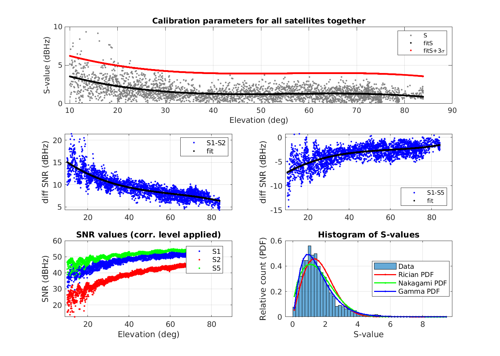
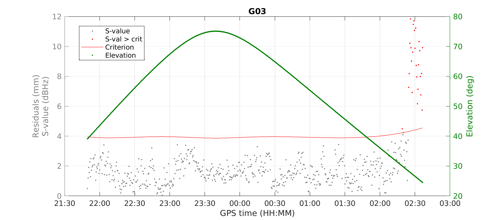

# SNRdetector
SNRdetector is a MATLAB based tool for detection of multipath in GNSS observation using Signal-to-Noise ratio measurements. Tool implements the method proposed in (Strode and Groves, 2016) which use measurements in low-multipath environment to "calibrate" user equipment (receiver, antenna) to use for multipath detection. Output of calibration are coeficients of polynomial regression of SNR differences for different frequencies. In settings of calibration one can choose if wants to use universal calibration (coefficient estimated for all satellites together) or individual calibration (each satellite has its own calibration coefficients). Original estimator uses three frequency to compute detection statistic, however this tool can be used also with just two frequencies and then it is possible to process not only data from GPS, but also from Glonass, Galileo and Beidou.

To start the program just run `processDetection.m` script from MATLAB command prompt. Example input files are included in `obs/calibration` (data from low-multipath environment) and `obs/testing` (data at site where reflections should occur). To compute position of satellites in these observation files the navigation messages are needed. These can be automatically downloaded for all navigation system, however `gzip` utility have to be installed on your computer and available on the path to uncompress the navigation messages automatically!

Every source file in `eph` or `fun` folder has documentation string and simple explanaition of its funcionality, so if you want to change something, you should be able to understand what's going on in particular function file.

## Calibration phase

  
   Example of calibration for data acquired in low-multipath environment 

## Detection phase

  
   Example of multipath detection using SNR detector 

# References
Strode, Philip R. R. and Paul D. Groves. *GNSS Multipath Detection Using Three-Frequency Signal-to-Noise Measurements*. GPS Solutions 20, no. 3 (July 2016): 399–412. https://doi.org/10.1007/s10291-015-0449-1.
